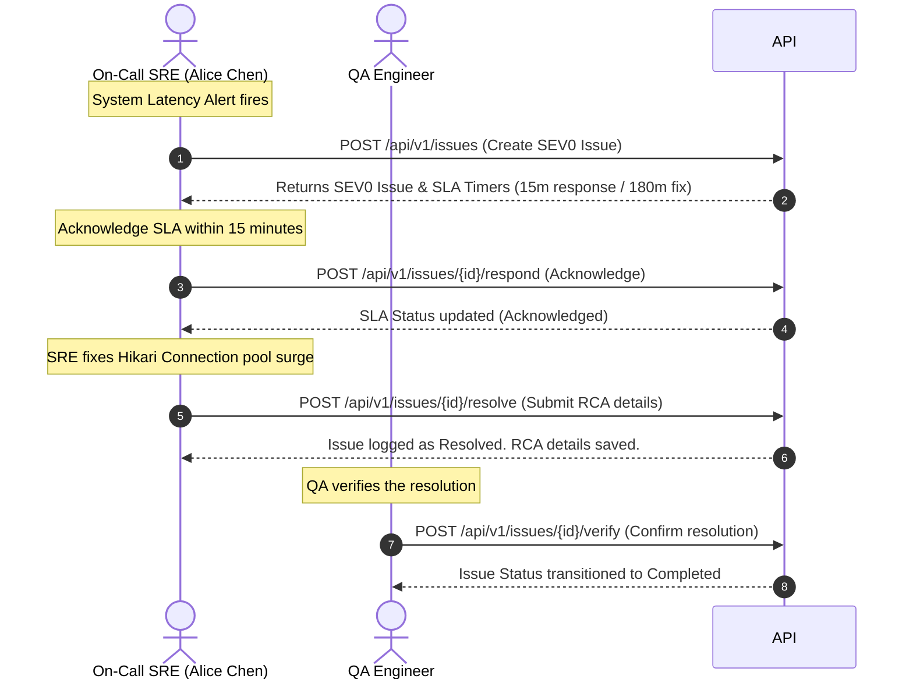
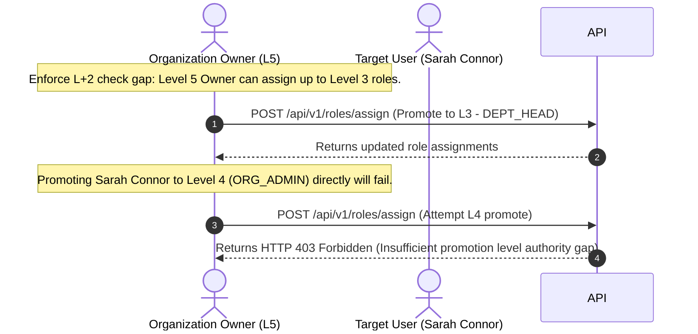
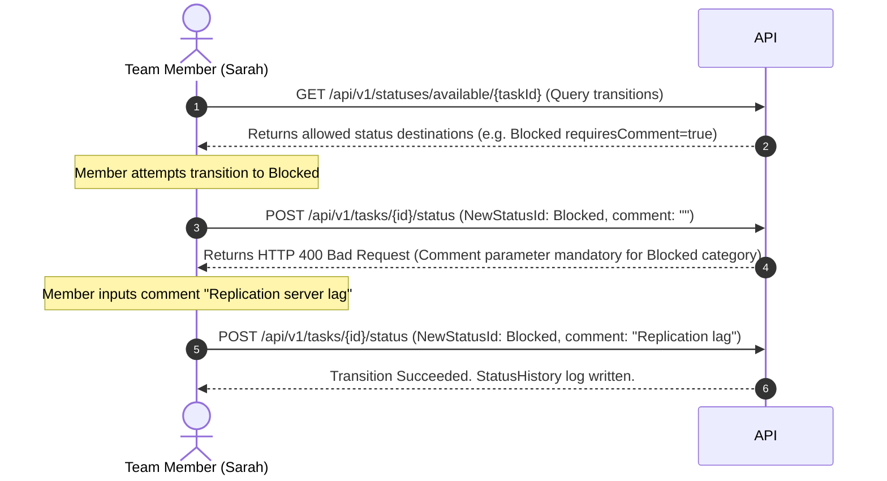

# TaskFlow Pro — System Specifications & API Catalog

This document details the complete feature sets, API endpoints, request/response payload schemas, and core workflows of **TaskFlow Pro**. This guide is designed for direct integration with AI frontend generation platforms (such as Lovable.dev or custom GPT/Claude engines) to build the corresponding client interface.

---

## Table of Contents
1. [Core Platform Architectures & Policies](#1-core-platform-architectures--policies)
2. [API Catalog & Payload Schemas](#2-api-catalog--payload-schemas)
   - [Authentication & Roles Hierarchy](#authentication--roles-hierarchy)
   - [Departments, Teams & Users](#departments-teams--users)
   - [Project Space Management](#project-space-management)
   - [Task Management, Comments & Fields](#task-management-comments--fields)
   - [Incident Response, SLA & On-Call](#incident-response-sla--on-call)
   - [Auto-Routing Rules & Workload Balancer](#auto-routing-rules--workload-balancer)
   - [Time Tracking & Timesheets](#time-tracking--timesheets)
   - [Workflow Automation Rules](#workflow-automation-rules)
   - [File Attachments](#file-attachments)
   - [Reporting & Analytics](#reporting--analytics)
3. [Step-by-Step System Workflows](#3-step-by-step-system-workflows)

---

## 1. Core Platform Architectures & Policies

### 1.1 Enterprise Role-Based Hierarchy
TaskFlow Pro operates on a strict level-based rank hierarchy. The rank level dictates execution authority and promotion capability:

| Rank Level | Role Name | Authority Scope | Reports To |
|---|---|---|---|
| **Level 5** | `ORG_OWNER` | Complete control, deletes organization, bills, promotes admins. | None (Top) |
| **Level 4** | `ORG_ADMIN` | Manages users, departments, projects, and custom fields. | `ORG_OWNER` |
| **Level 3** | `DEPT_HEAD` | Manages department teams, projects, approves budgets. | `ORG_ADMIN` |
| **Level 2** | `TEAM_LEAD` | Manages assignments, reviews logs, triggers auto-routing. | `DEPT_HEAD` |
| **Level 1** | `TEAM_MEMBER` | Executes tasks, logs time, comments. | `TEAM_LEAD` |
| **Level 0** | `GUEST` | View-only access, comments on public items. | `TEAM_LEAD` |

* **L+2 Authority Check Constraint:** An actor of level $R$ can only promote or assign roles to users up to level $R-2$.
  - Example: A `DEPT_HEAD` (L3) can only promote users up to `TEAM_MEMBER` (L1).
  - To promote someone to `DEPT_HEAD` (L3), the promoter must be at least `ORG_OWNER` (L5).
  - Ranks cannot be promoted to Level 4 (`ORG_ADMIN`) or Level 5 (`ORG_OWNER`) unless authorized by organizational ownership.

### 1.2 Task vs. Incident Separation
* **`TASK`:** Standard deliverables with a project board scope, assigned members, and due dates.
* **`ISSUE`:** Incident tickets triggered by alerts, customers, or systems.
  - Linked to a severity index (`SEV0`, `SEV1`, `SEV2`, `SEV3`).
  - Tied to response and fix SLA countdowns (minutes-based timers).
  - Triggers on-call pages to active primary SRE shifts.
  - Requires Root Cause Analysis (RCA) logging (`rootCause` + `resolution`) before state transitions to `Done`.

### 1.3 Custom Workflows & WIP Limits
* Boards are broken down into status columns with custom sort orders and colors.
* Columns map to categories: `PLANNING` (Backlog, Todo), `ACTIVE` (In Progress, In Review), `BLOCKED` (Blocked), and `COMPLETED` (Done).
* **WIP Limits:** Columns enforce active limits:
  - `PLANNING` limit: 5
  - `ACTIVE` limit: 3
  - `BLOCKED` limit: 1
  - Overloading a column flags a "WIP Limit Breached" alert warning.
* **State Transition Rules:** Custom rules restrict who can move cards (e.g. only Team Leads can move items to `Done`). Transitions to `BLOCKED` require block comment verification.

---

## 2. API Catalog & Payload Schemas

All endpoints are prefix-routed to `/api/v1`. Bearer JWT authorization headers are required for protected endpoints.

### Authentication & Roles Hierarchy

#### 1. Register User Space
* **Endpoint:** `POST /api/v1/auth/register`
* **Request Payload:**
  ```json
  {
    "email": "developer@taskflow.pro",
    "password": "SecurePassword123",
    "name": "Sarah Connor",
    "orgName": "Cyberdyne Systems"
  }
  ```
* **Response Payload (HTTP 200):**
  ```json
  {
    "accessToken": "eyJhbGciOi...",
    "refreshToken": "7c8d9e...",
    "userId": "44444444-4444-4444-4444-444444444444",
    "orgId": "org-cyberdyne-100",
    "email": "developer@taskflow.pro",
    "name": "Sarah Connor"
  }
  ```

#### 2. Authenticate login
* **Endpoint:** `POST /api/v1/auth/login`
* **Request Payload:**
  ```json
  {
    "email": "developer@taskflow.pro",
    "password": "SecurePassword123"
  }
  ```
* **Response Payload (HTTP 200):** Same as Register User Space response.

#### 3. Assign Role Level (Promote Roster)
* **Endpoint:** `POST /api/v1/roles/assign`
* **Request Payload:**
  ```json
  {
    "userId": "44444444-4444-4444-4444-444444444444",
    "roleLevel": 2,
    "roleName": "TEAM_LEAD",
    "departmentId": "d1e2f3...",
    "teamId": "t1a2b3..."
  }
  ```
* **Response Payload (HTTP 200):**
  ```json
  {
    "id": "role-uuid-1",
    "userId": "44444444-4444-4444-4444-444444444444",
    "roleLevel": 2,
    "roleName": "TEAM_LEAD",
    "departmentId": "d1e2f3...",
    "teamId": "t1a2b3..."
  }
  ```

#### 4. Revoke Role
* **Endpoint:** `DELETE /api/v1/roles/{roleId}`
* **Response:** `244 No Content`

#### 5. List Subordinate Tree
* **Endpoint:** `GET /api/v1/roles/subordinates`
* **Response Payload (HTTP 200):**
  ```json
  [
    {
      "id": "44444444-4444-4444-4444-444444444444",
      "name": "Sarah Connor",
      "email": "developer@taskflow.pro"
    }
  ]
  ```

---

### Departments, Teams & Users

#### 1. Create Department
* **Endpoint:** `POST /api/v1/departments`
* **Request Payload:**
  ```json
  {
    "name": "Platform Engineering",
    "description": "Kubernetes and core database replication service layer",
    "headUserId": "22222222-2222-2222-2222-222222222222",
    "parentDepartmentId": null
  }
  ```
* **Response Payload (HTTP 200):**
  ```json
  {
    "id": "d1e2f3-...",
    "name": "Platform Engineering",
    "description": "Kubernetes and core database replication service layer",
    "headUserId": "22222222-2222-2222-2222-222222222222",
    "organizationId": "org-cyberdyne-100"
  }
  ```

#### 2. Create Team in Department
* **Endpoint:** `POST /api/v1/departments/{departmentId}/teams`
* **Request Payload:**
  ```json
  {
    "name": "Frontend Core",
    "description": "Lumina Design and glassmorphism elements development",
    "leadUserId": "33333333-3333-3333-3333-333333333333"
  }
  ```
* **Response Payload (HTTP 200):**
  ```json
  {
    "id": "t1a2b3-...",
    "departmentId": "departmentId",
    "name": "Frontend Core",
    "description": "Lumina Design and glassmorphism elements development",
    "leadUserId": "33333333-3333-3333-3333-333333333333"
  }
  ```

#### 3. Update User Profile
* **Endpoint:** `PATCH /api/v1/users/me`
* **Request Payload:**
  ```json
  {
    "name": "Sarah Connor",
    "bio": "DevOps Architect",
    "avatarUrl": "https://storage.googleapis.com/avatar.jpg"
  }
  ```
* **Response Payload (HTTP 200):**
  ```json
  {
    "id": "44444444-4444-4444-4444-444444444444",
    "email": "developer@taskflow.pro",
    "name": "Sarah Connor",
    "bio": "DevOps Architect",
    "avatarUrl": "https://storage.googleapis.com/avatar.jpg"
  }
  ```

---

### Project Space Management

#### 1. Create Project
* **Endpoint:** `POST /api/v1/projects`
* **Request Payload:**
  ```json
  {
    "name": "SRE US-East Ingress Failover",
    "description": "Automatic failover setup for primary ingress nodes under latency spikes.",
    "type": "KANBAN",
    "startDate": "2026-05-28T18:00:00Z",
    "endDate": "2026-06-15T18:00:00Z"
  }
  ```
* **Response Payload (HTTP 200):**
  ```json
  {
    "id": "project-uuid-1",
    "name": "SRE US-East Ingress Failover",
    "description": "Automatic failover setup for primary ingress nodes under latency spikes.",
    "status": "ACTIVE",
    "type": "KANBAN",
    "startDate": "2026-05-28T18:00:00Z",
    "endDate": "2026-06-15T18:00:00Z",
    "organizationId": "org-cyberdyne-100"
  }
  ```

#### 2. List Projects
* **Endpoint:** `GET /api/v1/projects`
* **Response Payload (HTTP 200):** Array of Project objects.

#### 3. Update Project Space
* **Endpoint:** `PATCH /api/v1/projects/{projectId}`
* **Request Payload:**
  ```json
  {
    "name": "SRE Ingress Failover Refined",
    "status": "IN_REVIEW"
  }
  ```
* **Response Payload (HTTP 200):** Updated Project object.

#### 4. Add Member to Project
* **Endpoint:** `POST /api/v1/projects/{projectId}/members`
* **Request Payload:**
  ```json
  {
    "userId": "44444444-4444-4444-4444-444444444444",
    "role": "DEVELOPER"
  }
  ```
* **Response Payload (HTTP 200):**
  ```json
  {
    "id": "proj-member-uuid-1",
    "projectId": "projectId",
    "userId": "44444444-4444-4444-4444-444444444444",
    "role": "DEVELOPER"
  }
  ```

---

### Task Management, Comments & Fields

#### 1. Create standard Task
* **Endpoint:** `POST /api/v1/tasks`
* **Request Payload:**
  ```json
  {
    "title": "Migrate tokens to dynamic JWT claims",
    "description": "Adjust token claims parameter validations.",
    "projectId": "project-uuid-1",
    "dueDate": "2026-05-31T18:00:00Z",
    "assigneeIds": ["44444444-4444-4444-4444-444444444444"]
  }
  ```
* **Response Payload (HTTP 200):**
  ```json
  {
    "id": "task-uuid-10",
    "title": "Migrate tokens to dynamic JWT claims",
    "description": "Adjust token claims parameter validations.",
    "statusId": "s1",
    "projectId": "project-uuid-1",
    "taskType": "TASK",
    "createdAt": "2026-05-28T18:00:00Z",
    "dueDate": "2026-05-31T18:00:00Z",
    "assigneeIds": ["44444444-4444-4444-4444-444444444444"]
  }
  ```

#### 2. Get Task details
* **Endpoint:** `GET /api/v1/tasks/{id}`
* **Response Payload (HTTP 200):** Details of the Task object.

#### 3. Update Task parameters
* **Endpoint:** `PATCH /api/v1/tasks/{id}`
* **Request Payload:**
  ```json
  {
    "title": "Migrate JWT token validations (Refined)"
  }
  ```

#### 4. Add Task Dependency Link (Gantt timeline connections)
* **Endpoint:** `POST /api/v1/tasks/{id}/dependencies`
* **Request Payload:**
  ```json
  {
    "predecessorId": "task-uuid-predecessor",
    "dependencyType": "FINISH_TO_START"
  }
  ```
* **Response Payload (HTTP 200):**
  ```json
  {
    "id": "dep-link-uuid",
    "taskId": "id",
    "predecessorId": "task-uuid-predecessor",
    "dependencyType": "FINISH_TO_START"
  }
  ```

#### 5. Add Comment
* **Endpoint:** `POST /api/v1/tasks/{id}/comments`
* **Request Payload:**
  ```json
  {
    "content": "Transitioning node to Blocked due to network configuration lag."
  }
  ```
* **Response Payload (HTTP 200):**
  ```json
  {
    "id": "comment-uuid-1",
    "taskId": "id",
    "userId": "user-uuid",
    "content": "Transitioning node to Blocked due to network configuration lag.",
    "createdAt": "2026-05-28T18:00:00Z"
  }
  ```

#### 6. Configure custom status for Project
* **Endpoint:** `POST /api/v1/projects/{projectId}/statuses`
* **Request Payload:**
  ```json
  {
    "departmentId": "dept-uuid",
    "name": "Blocked",
    "category": "BLOCKED",
    "color": "#EF4444",
    "sortOrder": 50,
    "isDefault": false,
    "requiresComment": true,
    "requiresApproval": false,
    "autoTransitionDays": 3,
    "transitionToOnAuto": "s2"
  }
  ```
* **Response Payload (HTTP 200):** CustomTaskStatus object metadata.

---

### Incident Response, SLA & On-Call

#### 1. Raise Incident Issue
* **Endpoint:** `POST /api/v1/issues`
* **Request Payload:**
  ```json
  {
    "taskRequest": {
      "title": "US-East Ingress spikes above 1200ms latency limits",
      "description": "Ingress controllers failing connections replication.",
      "projectId": "project-uuid-1"
    },
    "severity": "SEV0",
    "environment": "Production",
    "affectedVersion": "v1.4.2",
    "customerReported": true,
    "customerName": "Acme Corp",
    "customerImpact": "Payment gateway processing fails completely"
  }
  ```
* **Response Payload (HTTP 200):**
  ```json
  {
    "id": "issue-detail-uuid-1",
    "taskId": "task-uuid-20",
    "severity": "SEV0",
    "environment": "Production",
    "affectedVersion": "v1.4.2",
    "customerReported": true,
    "customerName": "Acme Corp",
    "customerImpact": "Payment gateway processing fails completely",
    "slaBreached": false,
    "slaTargetResponse": "2026-05-28T18:15:00Z",
    "slaTargetFix": "2026-05-28T21:00:00Z"
  }
  ```

#### 2. Get Incident SLA status
* **Endpoint:** `GET /api/v1/issues/{issueId}/sla-status`
* **Response Payload (HTTP 200):**
  ```json
  {
    "minutesRemaining": 14,
    "breached": false
  }
  ```

#### 3. Acknowledge SLA (Respond to Incident)
* **Endpoint:** `POST /api/v1/issues/{issueId}/respond`
* **Response:** `200 OK` (Acknowledges SLA timer, stops response breach trigger)

#### 4. Resolve Incident SLA (Logs RCA details)
* **Endpoint:** `POST /api/v1/issues/{issueId}/resolve`
* **Request Payload:**
  ```json
  {
    "rootCause": "Hikari pool size exhausted under US-East traffic surge",
    "resolution": "Increased hikari maximumPoolSize from 15 to 45"
  }
  ```
* **Response:** `200 OK`

#### 5. Verify SLA Resolution (QA Sign-off)
* **Endpoint:** `POST /api/v1/issues/{issueId}/verify`
* **Response:** `200 OK`

#### 6. Link Duplicate Incidents
* **Endpoint:** `POST /api/v1/issues/{issueId}/duplicate/{parentId}`
* **Response:** `200 OK` (Links issue as duplicate of parent issue ID)

#### 7. Set On-Call Schedule Coverage
* **Endpoint:** `POST /api/v1/on-call/schedule`
* **Request Payload:**
  ```json
  {
    "userId": "11111111-1111-1111-1111-111111111111",
    "weekStartDate": "2026-05-25",
    "coverageType": "PRIMARY"
  }
  ```
* **Response Payload (HTTP 200):** OnCallSchedule object.

---

### Auto-Routing Rules & Workload Balancer

#### 1. Create Auto-Assignment Routing Rule
* **Endpoint:** `POST /api/v1/routing/rules`
* **Request Payload:**
  ```json
  {
    "ruleName": "Critical SRE Pager Routing",
    "taskType": "ISSUE",
    "triggerCondition": {
      "severity": "SEV0"
    },
    "sourceDepartmentId": null,
    "sourceTeamId": null,
    "targetDepartmentId": "d1e2f3...",
    "targetTeamId": null,
    "assignToRole": "DEPT_HEAD",
    "assignmentStrategy": "ON_CALL",
    "autoCreateSubtasks": true,
    "subtaskTemplate": {
      "title": "Analyze server logs",
      "description": "Evaluate metrics"
    },
    "priority": 10,
    "enabled": true
  }
  ```
* **Response Payload (HTTP 200):** RoutingRule object.

#### 2. Get Suggestion assignee for Task
* **Endpoint:** `GET /api/v1/tasks/suggest-assignee?taskId={taskId}`
* **Response Payload (HTTP 200):**
  ```json
  {
    "taskId": "task-uuid-20",
    "suggestedAssigneeId": "11111111-1111-1111-1111-111111111111",
    "reason": "Suggested via matching rule: Critical SRE Pager Routing using strategy: ON_CALL"
  }
  ```

#### 3. Trigger manual routing evaluation
* **Endpoint:** `POST /api/v1/tasks/{taskId}/route`
* **Response Payload (HTTP 200):**
  ```json
  {
    "taskId": "taskId",
    "routed": true,
    "assignedTo": "11111111-1111-1111-1111-111111111111"
  }
  ```

#### 4. Fetch User Capacity workload telemetry
* **Endpoint:** `GET /api/v1/workload/user/{userId}`
* **Response Payload (HTTP 200):**
  ```json
  {
    "userId": "userId",
    "totalActiveTasks": 6,
    "totalEstimatedHours": 32,
    "overloaded": true
  }
  ```

---

### Time Tracking & Timesheets

#### 1. Start Tracker stopwatch
* **Endpoint:** `POST /api/v1/time-entries/start`
* **Request Payload:**
  ```json
  {
    "taskId": "task-uuid-10"
  }
  ```
* **Response Payload (HTTP 200):**
  ```json
  {
    "id": "time-entry-uuid",
    "taskId": "task-uuid-10",
    "startTime": "2026-05-28T18:00:00Z",
    "endTime": null,
    "description": null,
    "billable": true
  }
  ```

#### 2. Stop Tracker stopwatch
* **Endpoint:** `POST /api/v1/time-entries/{id}/stop`
* **Response Payload (HTTP 200):** TimeEntry object containing calculated duration hours.

#### 3. Fetch current week Timesheet status
* **Endpoint:** `GET /api/v1/timesheets/current?date=2026-05-28`
* **Response Payload (HTTP 200):**
  ```json
  {
    "id": "timesheet-uuid-1",
    "userId": "user-uuid",
    "startDate": "2026-05-25",
    "endDate": "2026-05-31",
    "status": "APPROVED",
    "approvedBy": "Marcus Taylor (DEPT_HEAD)"
  }
  ```

#### 4. Submit Timesheet for approval
* **Endpoint:** `POST /api/v1/timesheets/{id}/submit`
* **Response Payload (HTTP 200):** Timesheet object (status transitions to `SUBMITTED`).

---

### Workflow Automation Rules

#### 1. Create Trigger rule
* **Endpoint:** `POST /api/v1/automations`
* **Request Payload:**
  ```json
  {
    "projectId": "project-uuid-1",
    "name": "Auto transition issues to Blocked",
    "description": "If predecessor tasks are delayed, transition issue to Blocked status.",
    "triggerType": "TASK_UPDATED",
    "conditions": [
      {
        "field": "status",
        "operator": "EQUALS",
        "value": "BLOCKED"
      }
    ],
    "actions": [
      {
        "actionType": "SEND_NOTIFICATION",
        "parameters": {
          "role": "DEPT_HEAD",
          "message": "Critical Ingress Task has been blocked!"
        }
      }
    ]
  }
  ```
* **Response Payload (HTTP 200):** AutomationRule object.

---

### File Attachments

#### 1. Upload File Attachment
* **Endpoint:** `POST /api/v1/files/upload`
* **Content-Type:** `multipart/form-data`
* **Request Parameters:**
  - `file`: (Binary File)
  - `entityType`: `"TASK"` or `"ISSUE"`
  - `entityId`: `task-uuid-10`
* **Response Payload (HTTP 200):**
  ```json
  {
    "id": "file-attachment-uuid",
    "originalFilename": "postgresql_failover_limits.config",
    "contentType": "application/octet-stream",
    "size": 4096,
    "entityType": "TASK",
    "entityId": "task-uuid-10",
    "uploadedAt": "2026-05-28T18:00:00Z"
  }
  ```

#### 2. Download File
* **Endpoint:** `GET /api/v1/files/{id}/download`
* **Response:** Returns the binary resource stream.

---

### Reporting & Analytics

#### 1. Generate Project completion progress report
* **Endpoint:** `GET /api/v1/reports/projects/{projectId}/completion`
* **Response Payload (HTTP 200):**
  ```json
  {
    "projectId": "projectId",
    "totalTasks": 48,
    "completedTasks": 32,
    "completionRate": 66.6,
    "overdueTasks": 2
  }
  ```

#### 2. Get Workload allocation summaries
* **Endpoint:** `GET /api/v1/reports/projects/{projectId}/workload`
* **Response Payload (HTTP 200):** Allocation hours mapped per team member.

---

## 3. Step-by-Step System Workflows

The following operational workflows outline how the endpoints link together in the UI interface. Use this structure for mock scenarios or orchestration flows.

### Workflow A: Incident Response Paging & Resolve


### Workflow B: L+2 Authority Role Promotion


### Workflow C: Custom Status Transition (Blocked comments prompt)

